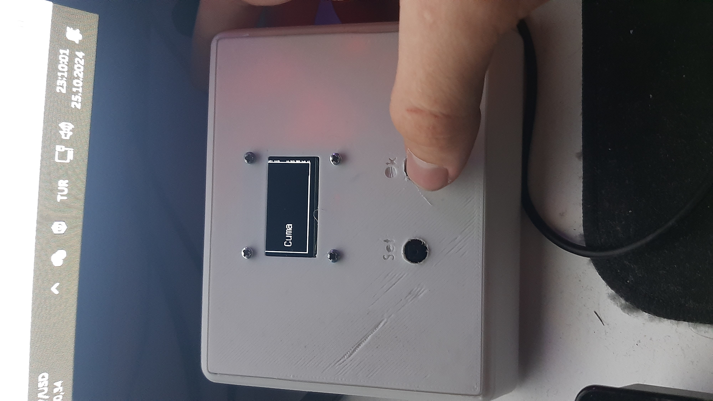

maxAddr Calculation: 24 hours x 60 minutes / recording frequency (In this example my frequency is 5 minutes)
You can edit recording frequency with editing Test.h header file or editing main code

sec: second 
mnt: minute
clk: hour
dayofweek: day of week :)
dd: day
mm: month
yyyy: year

Time & Date Screen:

Temperature & Humidity screen:

Time/Date changing screens:

The box was custom designed for the hardware of the project (the keypad was made by me, so its dimensions aren't fixed therefore places of hole may vary.) and printed with a 3D printer.
